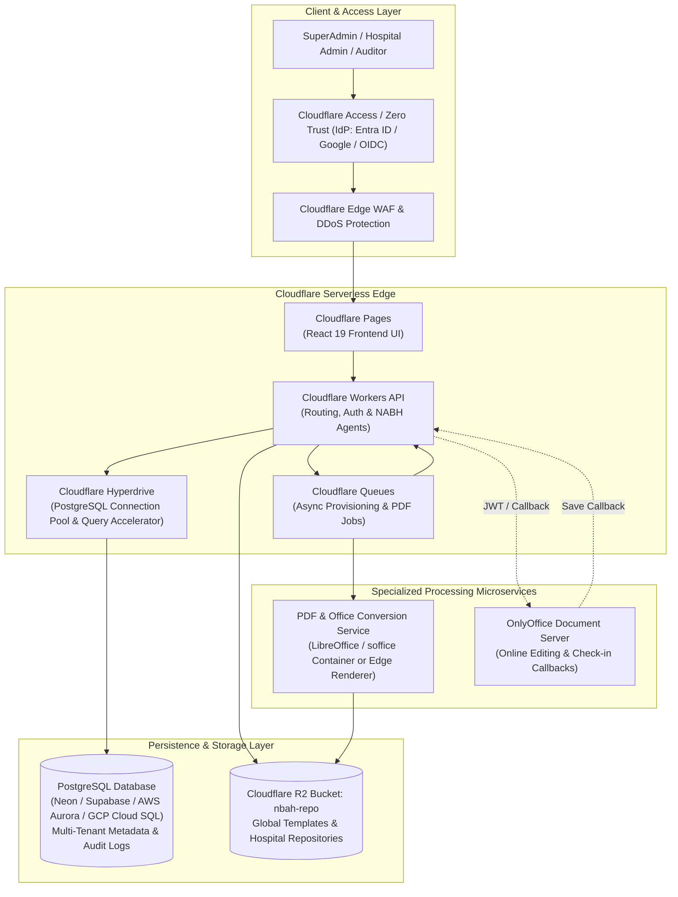
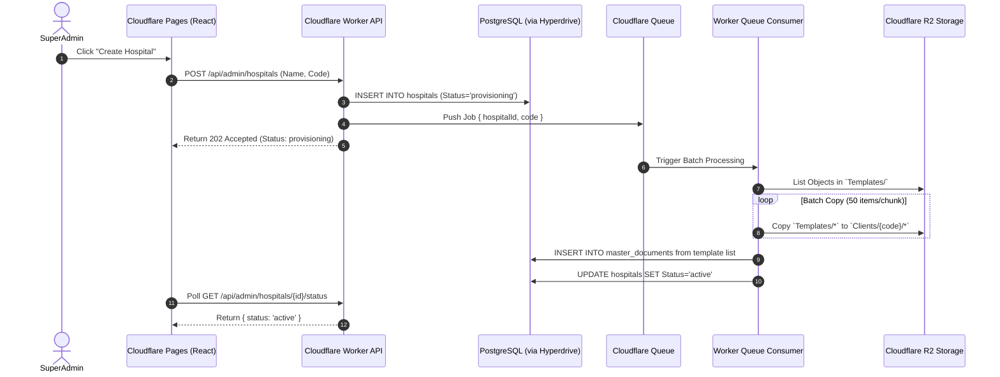

# NABH Workflow & Docs: Cloudflare + PostgreSQL Enterprise Architecture & Design Specification

## Executive Summary & System Overview

This document specifies the complete production architecture, system design, PostgreSQL relational schema, Cloudflare edge bindings, and operational workflows for migrating the **NABH Workflow & Governance Workspace** to a serverless architecture on **Cloudflare** backed by a high-availability **PostgreSQL** database.

The system manages hospital accreditation workflows, controlled document versions, master document registers, audit logging, and automated compliance pipelines across multiple hospital tenants.

---

## 1. System Architecture & Topology

The target architecture replaces local JSON files and monolithic Express servers with a multi-tenant, edge-rendered architecture using **Cloudflare Pages**, **Cloudflare Workers**, **Cloudflare Hyperdrive**, **Cloudflare R2**, **Cloudflare Queues**, and a managed **PostgreSQL** database cluster.



---

## 2. Component Design & Operational Responsibilities

### 2.1 Frontend Infrastructure (Cloudflare Pages)
- **Framework**: React 19 SPA built via Vite (`nabh-docs/web`).
- **CDN Distribution**: Deployed across 300+ global edge locations with static asset caching.
- **Routing**: API calls to `/api/*` are routed directly to the API Worker via Pages configuration, eliminating CORS preflight latency.

### 2.2 Serverless API Engine (Cloudflare Workers)
- **Runtime**: V8 isolations with sub-10ms startup latency.
- **Responsibilities**:
  - Validates JWT tokens and user claims from Cloudflare Access.
  - Enforces Role-Based Access Control (RBAC) per hospital tenant.
  - Serves Master List metadata, department registers, and audit trails from PostgreSQL via Hyperdrive.
  - Authorizes and streams documents securely from R2.
  - Dispatches heavy background tasks (such as template cloning and PDF rendering) to Cloudflare Queues.

### 2.3 Database Connectivity (Cloudflare Hyperdrive + PostgreSQL)
- **Database Engine**: PostgreSQL 15+ (Hosted on Neon, Supabase, AWS Aurora, or Cloud SQL).
- **Hyperdrive Integration**:
  - Maintains pooled TCP connection tunnels between Cloudflare edge nodes and PostgreSQL.
  - Eliminates serverless connection overhead (over 90% latency reduction for cold connections).
  - Caches read queries (roles, permissions, hospital lookup) at the edge.

### 2.4 Document Repository (Cloudflare R2 Bucket: `nbah-repo`)
- **Folder Conventions**:
  - `Templates/`: Global read-only master template library managed by SuperAdmins.
  - `Clients/{hospital_code}/`: Multi-tenant private folder per hospital.
  - `Clients/{hospital_code}/versions/{doc_hash}/`: Immutable version history objects (`v1.docx`, `v2.docx`, `manifest.json`).
- **Security**: Public bucket access is disabled; files are accessed exclusively via Workers after access checks.

### 2.5 Asynchronous Processing (Cloudflare Queues)
- **Hospital Provisioning**: Clones global templates into new hospital R2 directories asynchronously.
- **Document Conversion & Rendering**: Queues PDF rendering jobs for document previews and audit reports.

---

## 3. Database Schema (PostgreSQL DDL)

```sql
-- Enable UUID extension
CREATE EXTENSION IF NOT EXISTS "uuid-ossp";

-- 1. HOSPITALS (Multi-tenant root)
CREATE TABLE hospitals (
    id UUID PRIMARY KEY DEFAULT uuid_generate_v4(),
    code VARCHAR(12) UNIQUE NOT NULL,
    name VARCHAR(255) NOT NULL,
    logo_r2_key VARCHAR(512),
    status VARCHAR(20) NOT NULL DEFAULT 'active' CHECK (status IN ('active', 'inactive', 'provisioning')),
    created_at TIMESTAMPTZ NOT NULL DEFAULT NOW(),
    updated_at TIMESTAMPTZ NOT NULL DEFAULT NOW()
);

CREATE INDEX idx_hospitals_code ON hospitals(code);

-- 2. ROLES
CREATE TABLE roles (
    id UUID PRIMARY KEY DEFAULT uuid_generate_v4(),
    hospital_id UUID REFERENCES hospitals(id) ON DELETE CASCADE, -- NULL for global SuperAdmin
    name VARCHAR(100) NOT NULL,
    is_system_role BOOLEAN NOT NULL DEFAULT FALSE,
    created_at TIMESTAMPTZ NOT NULL DEFAULT NOW()
);

-- 3. PERMISSIONS
CREATE TABLE permissions (
    id UUID PRIMARY KEY DEFAULT uuid_generate_v4(),
    role_id UUID NOT NULL REFERENCES roles(id) ON DELETE CASCADE,
    permission_code VARCHAR(100) NOT NULL, -- 'view_documents', 'edit_documents', 'approve_documents', 'manage_users'
    UNIQUE(role_id, permission_code)
);

-- 4. USERS
CREATE TABLE users (
    id UUID PRIMARY KEY DEFAULT uuid_generate_v4(),
    hospital_id UUID REFERENCES hospitals(id) ON DELETE CASCADE,
    role_id UUID NOT NULL REFERENCES roles(id),
    email VARCHAR(255) UNIQUE NOT NULL,
    full_name VARCHAR(255) NOT NULL,
    status VARCHAR(20) NOT NULL DEFAULT 'active' CHECK (status IN ('active', 'inactive')),
    created_at TIMESTAMPTZ NOT NULL DEFAULT NOW(),
    updated_at TIMESTAMPTZ NOT NULL DEFAULT NOW()
);

CREATE INDEX idx_users_hospital ON users(hospital_id);
CREATE INDEX idx_users_email ON users(email);

-- 5. DEPARTMENTS
CREATE TABLE departments (
    id UUID PRIMARY KEY DEFAULT uuid_generate_v4(),
    code VARCHAR(50) NOT NULL UNIQUE,
    name VARCHAR(150) NOT NULL,
    display_order INT DEFAULT 0
);

-- 6. MASTER DOCUMENTS REGISTER
CREATE TABLE master_documents (
    id UUID PRIMARY KEY DEFAULT uuid_generate_v4(),
    hospital_id UUID NOT NULL REFERENCES hospitals(id) ON DELETE CASCADE,
    department_id UUID NOT NULL REFERENCES departments(id),
    document_id VARCHAR(100) NOT NULL, -- e.g. JPH/NABH/D-14A/Rev 00
    document_name VARCHAR(255) NOT NULL,
    r2_template_path VARCHAR(512),
    confidence VARCHAR(20) CHECK (confidence IN ('high', 'medium', 'low')),
    is_active BOOLEAN NOT NULL DEFAULT TRUE,
    is_approved BOOLEAN NOT NULL DEFAULT FALSE,
    current_version INT NOT NULL DEFAULT 1,
    reused_count INT DEFAULT 1,
    created_at TIMESTAMPTZ NOT NULL DEFAULT NOW(),
    updated_at TIMESTAMPTZ NOT NULL DEFAULT NOW(),
    UNIQUE(hospital_id, department_id, document_id)
);

CREATE INDEX idx_master_docs_hospital_dept ON master_documents(hospital_id, department_id);

-- 7. IMMUTABLE DOCUMENT REVISIONS
CREATE TABLE document_versions (
    id UUID PRIMARY KEY DEFAULT uuid_generate_v4(),
    master_document_id UUID NOT NULL REFERENCES master_documents(id) ON DELETE CASCADE,
    version_number INT NOT NULL,
    r2_object_key VARCHAR(512) NOT NULL,
    file_name VARCHAR(255) NOT NULL,
    file_hash VARCHAR(64) NOT NULL, -- SHA-256
    file_size_bytes BIGINT,
    editor_name VARCHAR(255) NOT NULL,
    editor_user_id UUID REFERENCES users(id),
    approval_note TEXT,
    action_type VARCHAR(50) NOT NULL, -- 'approved upload', 'document check-in', 'edited'
    created_at TIMESTAMPTZ NOT NULL DEFAULT NOW(),
    UNIQUE(master_document_id, version_number)
);

CREATE INDEX idx_doc_versions_master ON document_versions(master_document_id);

-- 8. COMPLIANCE & AUDIT LOGS
CREATE TABLE document_audit_logs (
    id UUID PRIMARY KEY DEFAULT uuid_generate_v4(),
    hospital_id UUID NOT NULL REFERENCES hospitals(id) ON DELETE CASCADE,
    master_document_id UUID REFERENCES master_documents(id) ON DELETE SET NULL,
    document_id_code VARCHAR(100),
    document_name VARCHAR(255),
    department_name VARCHAR(150),
    version_number INT,
    actor_name VARCHAR(255) NOT NULL,
    actor_user_id UUID REFERENCES users(id),
    action VARCHAR(50) NOT NULL, -- 'approved upload', 'edited', 'check-in', 'viewed', 'downloaded'
    note TEXT,
    file_hash VARCHAR(64),
    created_at TIMESTAMPTZ NOT NULL DEFAULT NOW()
);

CREATE INDEX idx_audit_hospital_date ON document_audit_logs(hospital_id, created_at DESC);
CREATE INDEX idx_audit_department ON document_audit_logs(department_name);

-- 9. WORKFLOW & PROVISIONING JOBS
CREATE TABLE workflow_jobs (
    id UUID PRIMARY KEY DEFAULT uuid_generate_v4(),
    hospital_id UUID NOT NULL REFERENCES hospitals(id) ON DELETE CASCADE,
    job_type VARCHAR(50) NOT NULL, -- 'repository_sync', 'pdf_conversion', 'batch_export'
    status VARCHAR(20) NOT NULL DEFAULT 'pending' CHECK (status IN ('pending', 'processing', 'completed', 'failed')),
    total_items INT DEFAULT 0,
    processed_items INT DEFAULT 0,
    error_message TEXT,
    created_at TIMESTAMPTZ NOT NULL DEFAULT NOW(),
    updated_at TIMESTAMPTZ NOT NULL DEFAULT NOW()
);
```

---

## 4. Worker Configuration & Source Implementation

### 4.1 `wrangler.jsonc` Configuration
```jsonc
{
  "$schema": "node_modules/wrangler/config-schema.json",
  "name": "nabh-api-worker",
  "main": "src/index.ts",
  "compatibility_date": "2026-09-01",
  "compatibility_flags": ["nodejs_compat"],

  "hyperdrive": [
    {
      "binding": "HYPERDRIVE",
      "id": "<HYPERDRIVE_CONFIG_ID>"
    }
  ],

  "r2_buckets": [
    {
      "binding": "NABH_REPOSITORY",
      "bucket_name": "nbah-repo"
    }
  ],

  "queues": {
    "producers": [
      {
        "binding": "PROVISION_QUEUE",
        "queue": "nabh-provisioning-queue"
      }
    ],
    "consumers": [
      {
        "queue": "nabh-provisioning-queue",
        "max_batch_size": 10,
        "max_batch_timeout": 30
      }
    ]
  },

  "vars": {
    "ENVIRONMENT": "production",
    "ONLYOFFICE_URL": "https://onlyoffice.yourhospital.domain"
  }
}
```

### 4.2 Cloudflare Worker Handler (`src/index.ts`)
```typescript
import { Client } from 'pg';

export interface Env {
  HYPERDRIVE: Hyperdrive;
  NABH_REPOSITORY: R2Bucket;
  PROVISION_QUEUE: Queue;
}

export default {
  async fetch(request: Request, env: Env, ctx: ExecutionContext): Promise<Response> {
    const url = new URL(request.url);

    // Hyperdrive Pooled PostgreSQL Client
    const client = new Client({ connectionString: env.HYPERDRIVE.connectionString });
    await client.connect();

    try {
      if (url.pathname === '/api/document-audit' && request.method === 'GET') {
        const hospitalId = url.searchParams.get('hospitalId');
        let query = `
          SELECT id, document_id_code AS "documentId", document_name AS "documentName",
                 department_name AS "department", version_number AS "version",
                 actor_name AS "approvedBy", action, note, file_hash AS "fileHash",
                 created_at AS "timestamp"
          FROM document_audit_logs
        `;
        const params: any[] = [];
        if (hospitalId) {
          query += ` WHERE hospital_id = $1`;
          params.push(hospitalId);
        }
        query += ` ORDER BY created_at DESC LIMIT 100`;

        const result = await client.query(query, params);
        return new Response(JSON.stringify({ entries: result.rows }), {
          headers: { 'Content-Type': 'application/json' }
        });
      }

      return new Response(JSON.stringify({ error: 'Endpoint not found' }), {
        status: 404,
        headers: { 'Content-Type': 'application/json' }
      });
    } catch (err: any) {
      return new Response(JSON.stringify({ error: err.message }), {
        status: 500,
        headers: { 'Content-Type': 'application/json' }
      });
    } finally {
      ctx.waitUntil(client.end());
    }
  }
};
```

---

## 5. Sequence Diagram: Hospital Onboarding & Repository Provisioning



---

## 6. Security, Compliance & Governance Controls

| Layer | Control Mechanism | Operational Benefit |
| --- | --- | --- |
| **Identity & Authentication** | Cloudflare Access Zero Trust | Enforces SAML 2.0 / OIDC SSO with Multi-Factor Authentication. |
| **Tenant Isolation** | PostgreSQL Row-Level Security (RLS) & R2 Path Prefixes | Guarantees strict multi-tenant boundary isolation (`Clients/{code}/`). |
| **Integrity Assurance** | SHA-256 File Hashing on every Check-in/Approval | Verifies immutable file version integrity for NABH accreditation audits. |
| **Data Encryption** | TLS 1.3 in transit + R2 / PostgreSQL AES-256 at rest | Protects sensitive patient data and operational documents end-to-end. |
| **Audit Compliance** | Automated SQL Audit Logs (`document_audit_logs`) | Provides tamper-evident approval history across all hospital repositories. |

---

## 7. Migration Execution Phases

1. **Phase 1: Database Setup**: Provision PostgreSQL instance (Neon/Supabase/Aurora), run DDL scripts, and configure Cloudflare Hyperdrive.
2. **Phase 2: R2 Storage Initialization**: Populate `Templates/` in R2 bucket (`nbah-repo`) with master document templates.
3. **Phase 3: Worker Service Migration**: Deploy Cloudflare API Worker replacing local Express endpoints.
4. **Phase 4: Frontend Pages Deployment**: Build React 19 UI bundle (`nabh-docs/web`) and deploy to Cloudflare Pages.
5. **Phase 5: Zero Trust Enforcement**: Protect admin endpoints with Cloudflare Access JWT validation rules.


## Operational checklist

- [ ] R2 bucket is private and bound to the Worker.
- [ ] `Templates/` publishing is restricted to SuperAdmin workflows.
- [ ] Each hospital uses an immutable, unique client code.
- [ ] `Clients/<CLIENT_CODE>/client.json` is created during provisioning.
- [ ] D1 stores hospital ownership, roles, and repository status.
- [ ] Queue consumers copy objects idempotently and never overwrite client edits.
- [ ] PDF previews are generated outside the Worker and cached in R2.
- [ ] Cloudflare Access protects all application routes.
- [ ] Downloads and document changes create audit events.
- [ ] Credentials exist only as Cloudflare Worker secrets or local ignored configuration.

## Local development commands

```zsh
# API server
cd nabh-docs
npm run server

# React development server
npm run ui

# Production frontend build
npm run ui:build
```

Local API URL: `http://127.0.0.1:4000`.

## Key source files

- `server.js`: current Express routes and application composition.
- `services/shared/r2TemplateService.js`: R2 template and client repository operations.
- `web/src/App.jsx`: Hospital Admin and SuperAdmin navigation.
- `web/src/TemplateLibrary.jsx`: SuperAdmin global template browser.
- `tools/nabh_template_generator/`: Office template generation and placeholder processing.